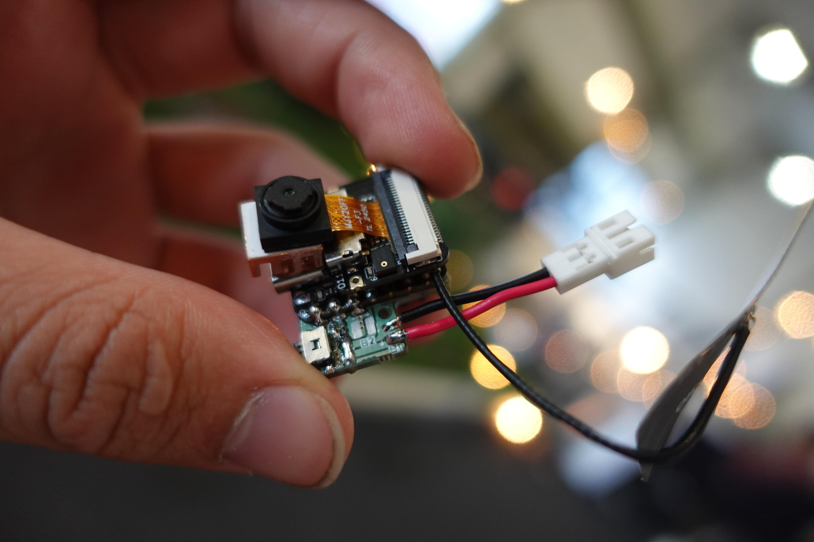

# Omi Glass DevKit PCB
_This repo contains PCB design files & fab ready Gerbers for the Omi Glass DevKit._  

### About
Omi Glass DevKit is based around the ESP32-S3 & OV2640, adding image capture to the [Omi](https://omi.me) AI platform.  For modularity, we selected the [Xiao ESP32-S3 Sense](https://www.seeedstudio.com/XIAO-ESP32S3-Sense-p-5639.html?srsltid=AfmBOopCIzfd-8ibewO1jBZsJkmfUc-wzWkLOngDRXb3vafw_r4tShg3) microcontroller breakout.  It also has an onboard microphone & microSD reader.

### Ordering
**`R` indicates PCB revision # and `V` indicates the glasses version.**
- `/export` contains zipped gerber files, `BOM` component list, and `PNP` file for Pick and Place.
- board height must be `.8mm`

### Changelog & Notes
- `V2` glasses use `EVQPUL\C`, `V3` uses `EVQP7L\C` buttons to reduce size.
- `V2` production files not provided or recommended for production.
- `R0.0` designs contain minor issues that are rectified in production.  Please use `R0.1` files if ordering.`
